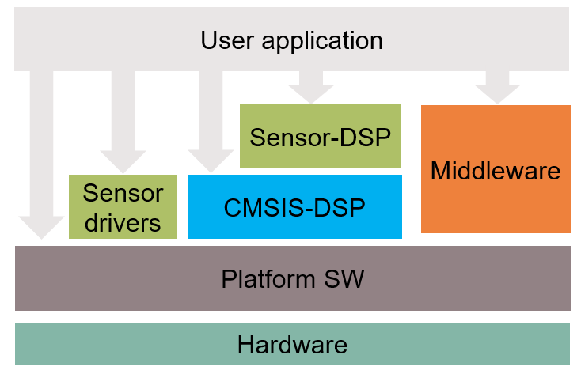

# Sensor-DSP Library

## Overview

The Sensor-DSP library provides signal processing functions required to support the implementation of different sensor applications, i.e. radar gesture recognition, vital sensing and presence detection. The Sensor-DSP library builds on top of the standard [ARM CMSIS-DSP](https://github.com/ARM-software/CMSIS-DSP) library.

   **Figure 1. Application architecture based on Sensor-DSP library and sensor drivers**

   

## Features

* Range and Doppler FFT
* FFT windowing related functions
* Detection related functions
* Angle estimation related functions
* Support functions

## Quick Start

Refer to the [API Reference Guide Quick Start Guide](https://infineon.github.io/sensor-dsp/html/index.html) section for step-by-step instruction how to enable the Sensor-DSP Library.

## Building for speed

Refer to [Building for speed](https://github.com/ARM-software/CMSIS-DSP#building-for-speed) for more information.

## Building for size

The application using the Sensor-DSP can control the size of the library by compiling in support for e.g. different types and supported lengths of FFTs.
As an example if you are only interested in the ifx_range_fft_f32 for length 128 and the ifx_doppler_cfft_f32 for length 16, you can add to the Makefile *DEFINES* of your ModusTooolbox project the following:
```
DEFINES+=-DARM_DSP_CONFIG_TABLES \
         -DARM_FAST_ALLOW_TABLES \
         -DARM_FFT_ALLOW_TABLES \
         -DARM_TABLE_TWIDDLECOEF_F32_16 \
         -DARM_TABLE_BITREVIDX_FLT_16 \
         -DARM_TABLE_TWIDDLECOEF_F32_64 \
         -DARM_TABLE_BITREVIDX_FLT_64 \
         -DARM_TABLE_TWIDDLECOEF_RFFT_F32_128 \
         -DARM_ALL_FAST_TABLES \
         -DARM_MATH_LOOPUNROLL \
         -DDISABLEFLOAT16 \
```

The needed preprocessor symbols can be generated using the *cmsisdspconfig.py* script present in the CMSIS-DSP folder found in mtb_shared after running `make getlibs` in your project.

```
$ streamlit run cmsisdspconfig.py
```
   **Figure 2. CMSIS-DSP Configuration**

   

Refer to [Compilation symbols for tables](https://github.com/ARM-software/CMSIS-DSP#compilation-symbols-for-tables) for more information.

## More information

For more information, refer to the following documents:

* [Sensor-DSP API Reference Guide](https://infineon.github.io/sensor-dsp/html/index.html)
* [ModusToolbox&trade; Software Environment, Quick Start Guide, Documentation, and Videos](https://www.infineon.com/cms/en/design-support/tools/sdk/modustoolbox-software)
* [PSoC 6 Technical Reference Manuals](https://www.infineon.com/cms/en/search.html#!term=PSOC%206%20%20Technical%20Reference%20Manual&view=downloads)
* [PSoC 6 Programmable System-on-Chip datasheets](https://www.infineon.com/cms/en/search.html#!term=PSOC%206%20%20Datasheet&view=downloads)
* [Infineon Technologies AG](https://www.infineon.com)

---------------------------------------------------------

© Infineon Technologies AG, 2022.
